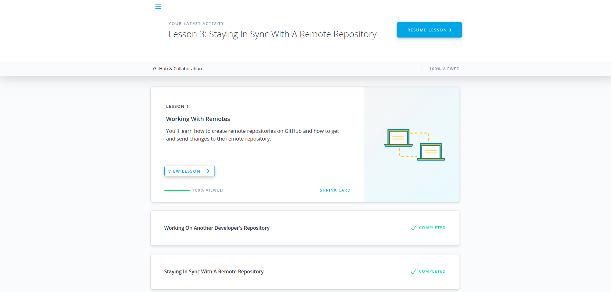

# Backend Course

The course contains basics of backend development: fundamentals of NodeJS or Golang and backend frameworks as well as necessary computer science basics, network and protocols, database fundamentals etc.

## Table of Contents

- [Git intro](#git-intro)
- [Unix shell](#unix-shell)
  - [Module 1](#module-1)
  - [Module 2](#module-2)
  - [Module 3](#module-3)
  - [Module 4](#module-4)
- [GitHub collaboration](#github-collaboration)
- [NodeJS basic 1](#nodejs-basic-1)
- [License](#license)

## Git intro

## Unix shell

### Module 1

___

### Module 2

___

### Module 3

___

### Module 4

___

## GitHub collaboration

## NodeJS basic 1

## License

[MIT](https://choosealicense.com/licenses/mit/)
